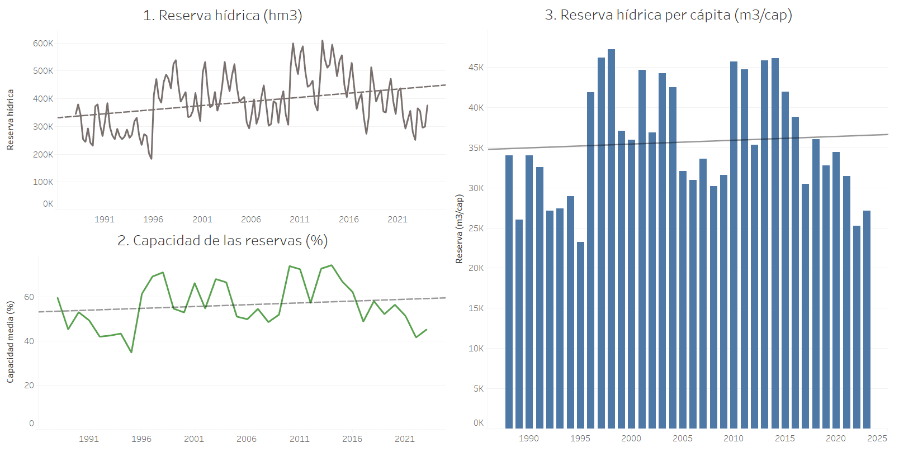
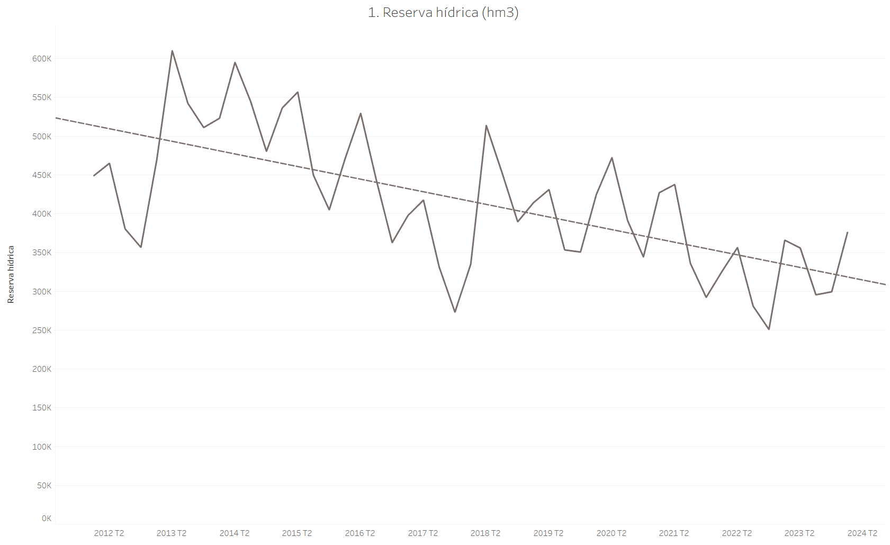

# ANÁLISIS DE LAS RESERVAS HÍDRICAS EN ESPAÑA   
## _Inestigación exploratoria del mundo (España)_

¿Son preocupantes las reservas de agua en España? ¿Debería preocuparnos el estado de los embalses en España? ¿Cómo es la tendencia desde que hay datos? ¿Cómo es la tendencia en los últimos años?

### Descripción:

- Análisis de las reservas de agua dulce en España
- Análisis de las capacidades totales de las reservas y embalses

### Proceso:

1. Descarga de datos de MITECO (Ministerio para la transición ecológica).
2. Limpieza y transformación de los datos para su correcta manipulación posterior.
3. Análisis exploratorio: ¿Qué nos cuentan los datos?.
4. Agrupar por fecha calculando el sumatorio de reservas actuales.
5. Presentación en Tableau Desktop.

### Conlusiones:

En primer lugar, fue necesario hacer una comprensión de los datos y ver que era necesario hacer agrupaciones por fechas comunes, para cancular las reservas hídricas actuales con respecto a la capacidad total. En segundo lugar, hice una gráfica de % de ocupación de los embalses para comprender cómo iba cambiando la reserva de agua. En último lugar, hice una comparación per cápita, añadiendo una nueva base de datos que nos daba la población exacta de cada año en España. Estas gráficas están representadas en la primera imagen.

Como hemos podido ver, las tendencias son positivas, a lo largo de los años nuestras reservas y el % con respecto del total aumentan. Pero si hacemos un filtro de los últimos 12 años, es decir, desde el 01 de enero de 2012, vemos que la tendencia es negativa. Ahora bien, el clima es un sistema complejo ya que todas sus características dependen de la naturaleza en su mayor medida y no se pueden predecir ni preveer. Por esa misma razón, decir que vamos hacia una época de sequía o que nuestros embalses van a acabar en mínimos es un atrevimiento excesivo, esa es la tendencia, pero esto, al ser un sistema complejo, no se puede predecir:

